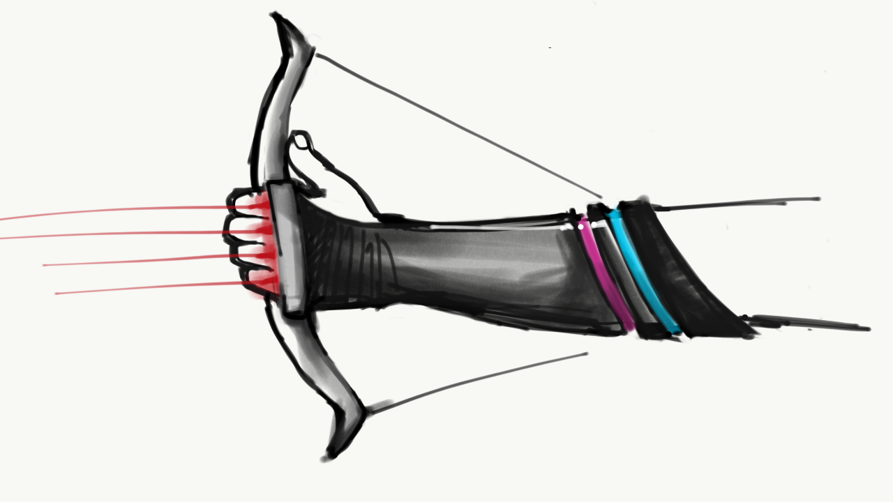
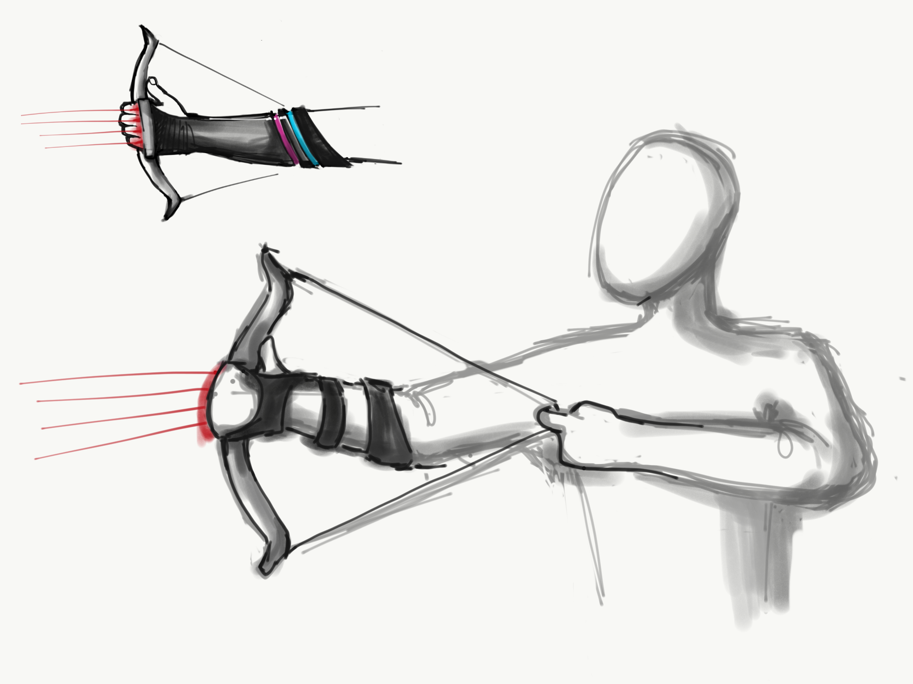
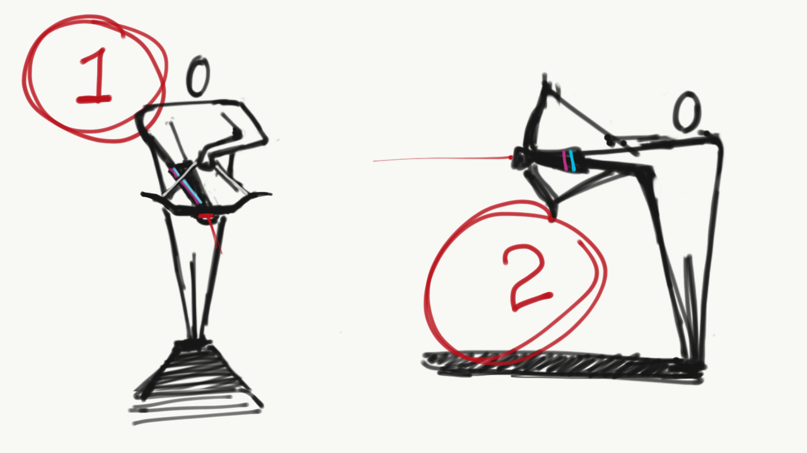

# Original Design

# Forearm-weapon
long range weapon on the forearm

#Parts: 
3d printed parts 
2 Rubber Bands 
1 Single Turn 3/8" Square Cermet 10k Potentiometer 
1" Google Cardboard lens for IR tube 
IR LED 
Arduino Mini Pro 
Wire 
3.3v Laser Pointer module 

