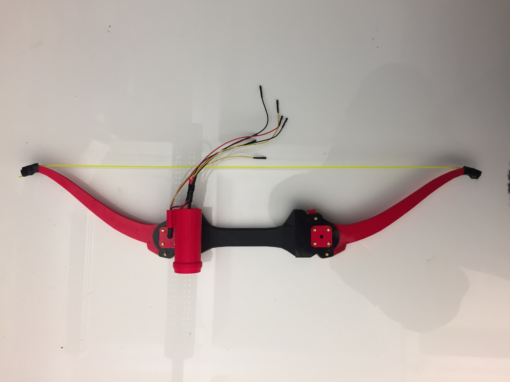
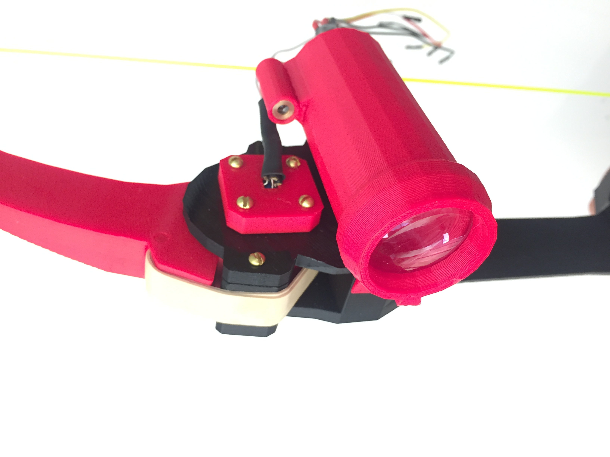
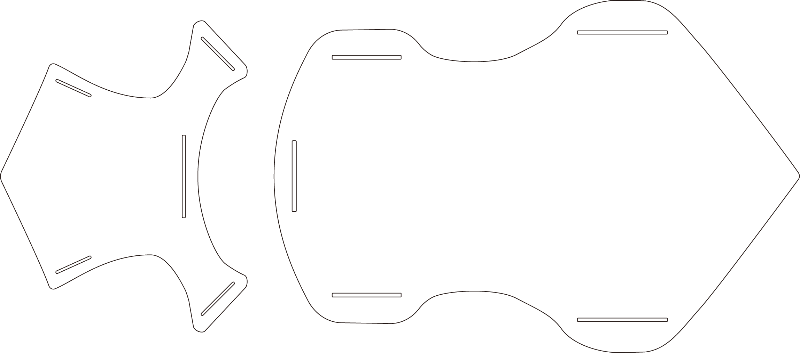
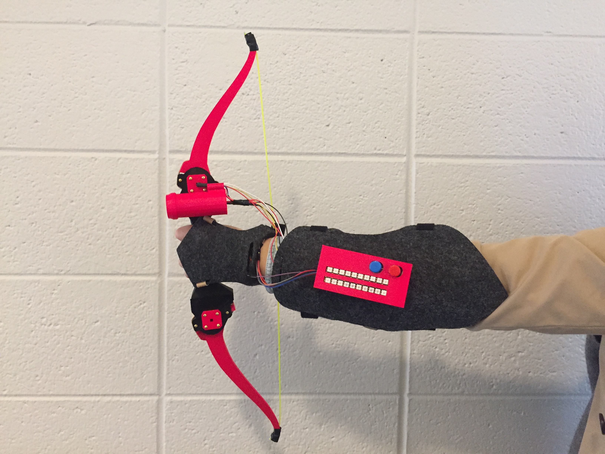
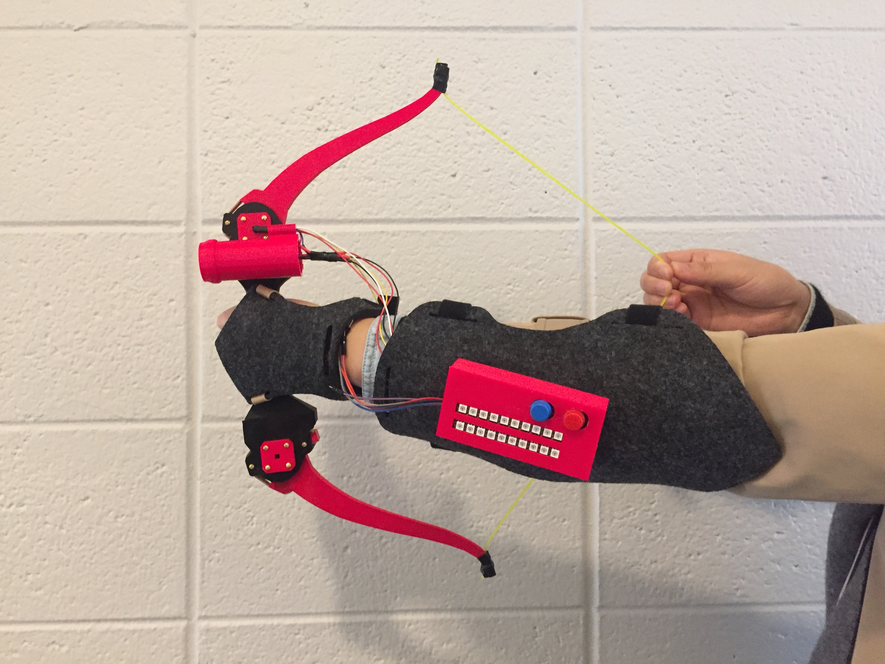

# Original Design

# Forearm-weapon
long range weapon on the forearm

### Parts: 
3d printed parts 
2 Rubber Bands 
1 Single Turn 3/8" Square Cermet 10k Potentiometer 
1" Google Cardboard lens for IR tube 
IR LED 
Arduino Mini Pro 
Wire 
3.3v Laser Pointer module 

# Gauntlet

### Features: 
1.The shape of gauntlet is symmetrical which could fit both left-handed and right-handed users. 
2.The gauntlet is adjustable by using elastic robber band and velcro. 
3.The shape of gauntlet is simple so that potential users are able to cut various soft metarial easily with scissors instead of using laser cut machine.  
4.Gauntlet itself actually indicates identity of the player as a "warrior". 

# Usage

